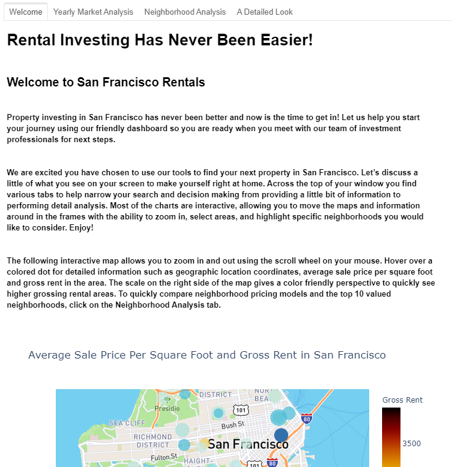
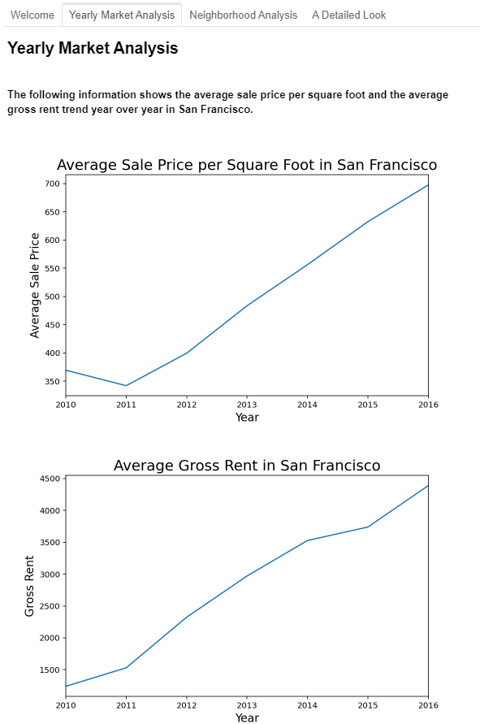

# Pythonic Monopoly
A project to help customers visually analyze and interact with data using a dashboard and determine if they would like to invest in rental property.

---

## Table of contents
* [General info](#general-info)
* [Screenshots](#screenshots)
* [Technologies](#technologies)
* [Installation Guide](#installation-guide)
* [Code Examples](#code-examples)
* [Usage](#usage)
* [Sources](#sources)
* [Status](#status)
* [Contributors](#contributors)

---

## General Information

---

## Screenshots

* These are various tabs, visual plots and designs used in the layout of the dashboard.

---

## Technologies

* Python - Version 3.7.7
* VS Code - Version 1.49.1
* Jupyter Notebook - Version 6.1.1
* Windows 10
* Library - panel
* Library - plotly.express
* Library - pandas
* Library - hvplot.pandas
* Library - matplotlib.pyplot
* Library - os
* Library - pathlib
* Library - dotenv

---

## Installation Guide

---

## Code Examples

---

## Usage

---

## Sources

- [1] https://rice.bootcampcontent.com/Rice-Coding-Bootcamp/rice-hou-fin-pt-09-2020-u-c/tree/master/hw/06-PyViz/Instructions

- [2] https://hvplot.holoviz.org/user_guide/Customization.html

- [3] https://plotly.com/python/discrete-color/

- [4] https://plotly.com/python/builtin-colorscales/

---

## Status

Project is:  _in progress_

---

## Contributors

* Jonathan Owens
* LinkedIn: www.linkedin.com/in/jonowens
