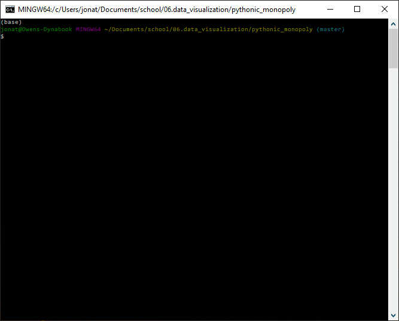

# Pythonic Monopoly
A project via the Rice University FinTech Bootcamp to help customers visually analyze and interact with data using a dashboard and determine if they would like to invest in rental property.

---

## Table of contents
* [General info](#general-info)
* [Screenshots](#screenshots)
* [Technologies](#technologies)
* [Installation Guide](#installation-guide)
* [Code Examples](#code-examples)
* [Usage](#usage)
* [Sources](#sources)
* [Status](#status)
* [Contributors](#contributors)

---

## General Information

Harold's company has just started a new Real Estate Investment division to provide customers with a broader range of portfolio options.  Harold needs my help to build a prototype dashboard for the real estate team to trial during the initial offering with investment opportunities for the San Francisco market.[1]

The goal of this dashboard is to provide charts, maps, and interactive visualizations that help customers explore the data and determine if they want to invest in rental properties in San Francisco.[1]

---

## Screenshots

* These are various tabs, visual plots and designs used in the layout of the dashboard.

* 

* 

* 

* 

---

## Technologies

* Python - Version 3.7.7
* VS Code - Version 1.49.1
* Jupyter Notebook - Version 6.1.1
* Windows 10
* Library - panel
* Library - plotly.express
* Library - pandas
* Library - hvplot.pandas
* Library - matplotlib.pyplot
* Library - os
* Library - pathlib
* Library - dotenv

---

## Installation Guide

1. Download the entire pythonic_monopoly repository
2. Open Git Terminal
3. Navigate into the repository file path where you stored the files during the download.
4. The files should be visible and ready to run.

*See the [Usage](#usage) section below for instructions on how to run the dashboard.

---

## Code Examples

### A parallel categories plot

-  Found on the tab titled "A Detailed Look" to gain a visual perspective how categories of the data are connected.

``` python
def parallel_categories():
    """Parallel Categories Plot."""
    
    # Getting the data from the top 10 expensive neighborhoods
    sfo_data_neighborhood_cat = sfo_data.groupby(['neighborhood']).mean()
    sfo_data_neighborhood_cat = sfo_data_neighborhood_cat.sort_values(by='sale_price_sqr_foot', ascending=False)
    sfo_data_top_ten = sfo_data_neighborhood_cat[0:10].reset_index()

    # Parallel Categories Plot
    p_categor = px.parallel_categories(
        sfo_data_top_ten,
        dimensions=["neighborhood", "sale_price_sqr_foot", "housing_units", "gross_rent"],
        color="sale_price_sqr_foot",
        color_continuous_scale=px.colors.sequential.Inferno,
        labels={
            "neighborhood": "Neighborhood",
            "sale_price_sqr_foot": "Sale Price Per Sqr Ft",
            "housing_units": "Housing Units",
            "gross_rent": "Gross Rent"
        }
    )
    
    # Return plotly express plot    
    return p_categor
```

- Sample image from the code above:


### A parallel coordinates plot

-  Found on the tab titled "A Detailed Look" to gain a visual perspective how the data points are connected.  This is a great tool for viewing the connections of geographic coordinates as well.

``` python
def parallel_coordinates():
    """Parallel Coordinates Plot."""
    
    # Getting the data from the top 10 expensive neighborhoods
    # Group, sort and pull top 10 rows of data for neighborhoods
    sfo_data_top_ten = group_sort_top_10(sfo_data)

    # Parallel Coordinates Plot
    p_coordinates = px.parallel_coordinates(
        sfo_data_top_ten,
        dimensions=["sale_price_sqr_foot", "housing_units", "gross_rent"],
        color="sale_price_sqr_foot",
        color_continuous_scale=px.colors.sequential.Inferno,
        labels={
            "sale_price_sqr_foot": "Sale Price Per Sqr Ft",
            "housing_units": "Housing Units",
            "gross_rent": "Gross Rent"
        }
    )
    
    # Return plotly express plot
    return p_coordinates
```

- Sample image from the code above:


---

## Usage

### Starting the dashboard

1. Open a Terminal window.

2. Make sure to activate your conda environment with the preinstall libraries.

3. Verify you are in the correct repository titled 'pythonic_monopoly'.

4. Type 'bash run.sh'.

5. This will start the panel dashboard.  Right clicking and choose Mark from the drop down menu allows you to highlight, copy and paste the localhost URL into your browser for initial testing.  *Note: you may need to press Ctrl + Shift + C to copy the highlighted text from your Terminal window.  You must keep your Terminal window open while using the dashboard.

*The following animated GIF allows for a visual representation on how to use the run.sh file and navigate the dashboard.



### Tab Viewing
Here is a sample of the tab functionality.


### Navigating interactive plots
This shows how to move around the interactive plots and to zoom in and out using your mouse wheel.


### Closing the Dashboard Pane

1. Close your browser window

2. Navigate to your Terminal window and press Ctrl + C twice to stop the task from running.

---

## Sources

- [1] https://rice.bootcampcontent.com/Rice-Coding-Bootcamp/rice-hou-fin-pt-09-2020-u-c/tree/master/hw/06-PyViz/Instructions

- [2] https://hvplot.holoviz.org/user_guide/Customization.html

- [3] https://plotly.com/python/discrete-color/

- [4] https://plotly.com/python/builtin-colorscales/

---

## Status

Project is:  _finished_

---

## Contributors

* Jonathan Owens
* LinkedIn: www.linkedin.com/in/jonowens
